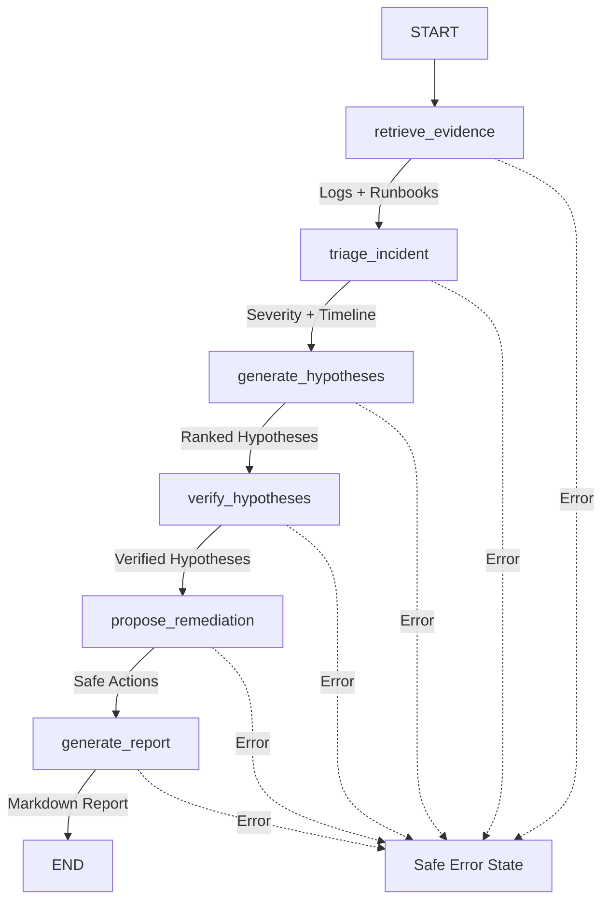

# OpsPilot Agent

An evidence-grounded agent for diagnosing software incidents using incident descriptions, application logs, and operational runbooks.

## Project Overview

OpsPilot is an intelligent agent system designed to assist DevOps and SRE teams in diagnosing and resolving software incidents efficiently. By analyzing incident data, application logs, and organizational runbooks, OpsPilot provides evidence-based insights and remediation recommendations.

### Key Features (Planned)

- **Evidence-Grounded Analysis**: Grounds all diagnoses in concrete evidence from logs and runbooks
- **Multi-Agent Architecture**: Specialized agents for different aspects of incident analysis
- **Runbook Integration**: Leverages organizational knowledge and best practices
- **Interactive Diagnosis**: Streamlit-based interface for real-time incident investigation
- **Dual Mode Operation**: 
  - **Demo Mode**: Simulated scenarios for testing and demonstration
  - **Live Mode**: Integration with OpenAI API for production use

## Development Status

**Current Phase**: End-to-End Workflow & Reporting ✅

- [x] Project structure and configuration
- [x] Core configuration management with Pydantic
- [x] Basic Streamlit UI foundation
- [x] Evidence retrieval system (BM25-based)
- [x] Log parsing capabilities
- [x] Runbook indexing
- [x] Evidence-grounded incident triage (offline demo mode)
- [x] Root cause diagnosis with ranked hypotheses
- [x] Independent evidence verification
- [x] Safe remediation recommendation engine
- [x] Multi-agent workflow orchestration (LangGraph)
- [x] Professional incident report generation (Markdown)
- [x] Interactive diagnosis interface (Streamlit)
- [ ] LLM-powered agents (OpenAI integration)

## Current MVP Progress

### Local Evidence Retrieval (Completed)

OpsPilot now includes a functional local evidence retrieval system that operates without external API calls:

**Log Parsing** ([src/opspilot/tools/log_parser.py](src/opspilot/tools/log_parser.py))
- Parses structured log files with timestamp, level, service, and message
- Preserves original line numbers for accurate source citations
- Handles malformed and blank lines gracefully
- Supports batch processing of multiple log files

**BM25 Evidence Retrieval** ([src/opspilot/tools/evidence_retriever.py](src/opspilot/tools/evidence_retriever.py))
- Indexes log entries and runbook content for fast local search
- Uses BM25Okapi algorithm for relevance-ranked retrieval
- Returns evidence with stable IDs, source file, line number, and score
- Supports querying across both logs and operational runbooks
- No network requests or external dependencies required

**Synthetic Incident Data** ([data/incidents/](data/incidents/))
- Realistic microservice incident scenario (database connection pool exhaustion)
- Complete causal timeline from reporting worker query → pool exhaustion → API failures
- Synthetic logs with no real credentials or PII
- Corresponding operational runbook with diagnostic guidance

**Data Models** ([src/opspilot/models.py](src/opspilot/models.py))
- Type-safe Pydantic models for Incident, LogEntry, and EvidenceChunk
- Severity enum (SEV1-SEV4) with clear definitions
- TimelineEvent and TriageResult models for structured assessments
- Validated structure for evidence citations and metadata

### Offline Incident Triage (Completed)

OpsPilot now includes an evidence-grounded triage component that operates in offline demo mode without LLM calls:

**Demo Triage Agent** ([src/opspilot/agents/triage.py](src/opspilot/agents/triage.py))
- Deterministic, rule-based triage assessment
- Severity classification based on evidence patterns:
  - SEV2 for repeated HTTP 5xx errors and connection pool exhaustion
  - SEV3 for limited degradation
  - SEV4 for insufficient evidence
- Extracts affected services, symptoms, and timeline from evidence
- Never claims root cause - explicitly marks as triage assessment only
- Fully deterministic: identical input produces identical output

**Triage Result Features**
- **Evidence-Grounded**: All services, symptoms, and timeline events sourced from evidence
- **Chronological Timeline**: Events sorted by timestamp with source citations
- **Confidence Scoring**: 0.0-1.0 score based on evidence quantity and quality
- **Human Review Flags**: SEV1/SEV2 incidents automatically flagged for review
- **Stable Evidence IDs**: All timeline events reference valid evidence chunks
- **Safe Failure Mode**: Empty evidence produces low-confidence SEV4 result

**Key Design Principles**
- No network requests or LLM calls (offline demo mode)
- No invented data - only extracts from provided evidence
- Modular severity logic ready for LLM replacement
- Type-safe structured outputs with Pydantic validation

### Root Cause Diagnosis & Verification (Completed)

OpsPilot now includes evidence-grounded diagnosis and independent verification components operating in offline demo mode:

**Diagnosis Agent** ([src/opspilot/agents/diagnosis.py](src/opspilot/agents/diagnosis.py))
- Generates multiple ranked root cause hypotheses from evidence patterns
- Recognizes common patterns: pool exhaustion, long-running queries, timeouts, HTTP 5xx failures, resource saturation
- Ranks hypotheses by confidence score (0.0-1.0)
- Distinguishes correlation from causation in reasoning
- Never recommends or executes remediation actions
- Fully deterministic: identical input produces identical output

**Verification Agent** ([src/opspilot/agents/verifier.py](src/opspilot/agents/verifier.py))
- Independently verifies each hypothesis against cited evidence
- Confirms all evidence IDs exist and are valid
- Marks hypotheses as supported, partially supported, or unsupported
- Rejects fabricated hypotheses (e.g., DNS, security breach, hardware failure) with no supporting evidence
- Removes invalid evidence citations
- Never increases confidence scores - only maintains or reduces
- Identifies missing evidence needed for stronger conclusions

**Hypothesis Features**
- **Stable IDs**: Hash-based unique identifiers for each hypothesis
- **Evidence Citations**: All claims linked to specific evidence chunks
- **Confidence Scoring**: Based on evidence strength and pattern clarity
- **Status Tracking**: Verification status (supported/partially_supported/unsupported)
- **Missing Evidence**: Explicit gaps identified for investigation
- **Human Review Required**: All hypotheses flagged for human validation

**Key Safety Principles**
- No invented evidence or fabricated scenarios
- Correlation explicitly distinguished from causation
- All confidence adjustments are reductions or neutral (never increases)
- Fabricated hypotheses (DNS, security, hardware) rejected when unsupported
- All conclusions require human review before action
- Remediation recommendations provided but never executed automatically

### Safe Remediation Planning (Completed)

OpsPilot now includes a safe remediation planning component that generates recommendations based on verified hypotheses and runbook guidance:

**Remediation Agent** ([src/opspilot/agents/remediation.py](src/opspilot/agents/remediation.py))
- Generates recommendations only from verified hypotheses and runbook evidence
- Categorizes actions: investigation, containment, recovery, prevention
- Assigns risk levels (low, medium, high, critical) to each action
- All state-changing actions require human approval
- Never executes any actions automatically
- Includes validation steps and rollback considerations
- Cites supporting evidence for each recommendation

**Remediation Features**
- **Evidence-Based**: All recommendations grounded in verified hypotheses and runbooks
- **Risk Assessment**: Each action labeled with appropriate risk level
- **Human Approval Required**: All medium/high/critical risk actions flagged for approval
- **Safety First**: Never recommends terminating queries without coordination
- **Validation & Rollback**: Each action includes how to validate and rollback
- **No Execution**: Generates recommendations only, never executes

### LangGraph Workflow (Completed)

OpsPilot now includes an end-to-end workflow orchestration system using LangGraph:

**Workflow** ([src/opspilot/workflow.py](src/opspilot/workflow.py))

The workflow connects all components in a deterministic pipeline:

```
START
  ↓
retrieve_evidence (BM25 retrieval from logs & runbooks)
  ↓
triage_incident (Severity classification & timeline)
  ↓
generate_hypotheses (Ranked root cause hypotheses)
  ↓
verify_hypotheses (Independent verification)
  ↓
propose_remediation (Safe action recommendations)
  ↓
generate_report (Professional Markdown report)
  ↓
END
```

**Workflow Features**
- **Typed State**: TypedDict-based state management for type safety
- **Error Handling**: Safe error capture without exposing stack traces
- **Deterministic**: Identical inputs produce identical outputs
- **No LLM Calls**: Operates entirely offline in demo mode
- **Safe Failure**: Each node handles missing data gracefully
- **Dependency Enforcement**: Each node validates required inputs

**Workflow State**
- `incident`: Incident metadata
- `investigation_query`: Query for evidence retrieval
- `evidence`: Retrieved evidence chunks
- `triage_result`: Triage assessment
- `diagnosis_result`: Root cause hypotheses
- `verification_result`: Verification outcomes
- `remediation_plan`: Safe recommendations
- `incident_report`: Markdown report
- `workflow_status`: Current workflow status
- `errors`: Safe error messages

### Professional Incident Reporting (Completed)

OpsPilot generates comprehensive, human-readable incident reports in Markdown format:

**Report Generator** ([src/opspilot/reporting.py](src/opspilot/reporting.py))
- Generates professional Markdown reports suitable for documentation
- Includes all analysis phases with evidence citations
- Clearly identifies verified vs. rejected hypotheses
- Lists categorized remediation recommendations
- Provides evidence references with source file and line number
- Includes prominent human review warnings
- Escapes special characters for safe Markdown rendering
- Deterministic output (no timestamps unless provided)

**Report Sections**
1. **Executive Summary**: Severity, affected services, symptoms
2. **Evidence-Based Timeline**: Chronological events with citations
3. **Root Cause Analysis**: Verified hypotheses and rejected ones
4. **Recommended Actions**: Categorized by type and risk level
5. **Analysis Limitations**: Known gaps and constraints
6. **Evidence References**: Source files and line ranges
7. **Human Review Required**: Prominent safety warnings

### Interactive Streamlit Interface (Completed)

OpsPilot includes a professional web interface for incident investigation:

**Application** ([app.py](app.py))
- Clean, professional engineering tool design
- Wide layout optimized for data-heavy views
- Offline demo mode indicator
- Human review safety warnings throughout
- Session state management for persistent results

**UI Features**

*Incident Selection*
- Displays incident metadata (ID, title, start time, status)
- Shows affected services and reported symptoms
- Lists available data files (logs, runbooks)

*Investigation Controls*
- Configurable investigation query with sensible defaults
- Evidence limit control (5-30 chunks)
- Run Investigation button to execute workflow
- Reset button to clear results

*Results Presentation* (5 tabs)

1. **Overview Tab**
   - Workflow status and key metrics
   - Severity and confidence scores
   - Affected services and symptoms
   - Triage rationale
   - Human review requirements

2. **Timeline & Evidence Tab**
   - Chronological timeline table with timestamps, services, descriptions
   - Evidence table showing ID, source, type, line number, score, content
   - Easy cross-referencing between timeline and evidence

3. **Root Cause Hypotheses Tab**
   - Hypotheses in ranked order
   - Status badges (supported, partially supported, unsupported)
   - Confidence scores and detailed reasoning
   - Supporting evidence IDs with expandable details
   - Missing evidence identification
   - Rejected hypotheses listed separately
   - Analysis limitations

4. **Remediation Plan Tab**
   - Actions grouped by category (investigation, containment, recovery, prevention)
   - Priority ranking and risk levels (color-coded)
   - Human approval requirements clearly marked
   - Rationale, validation steps, and rollback considerations
   - Supporting evidence IDs
   - Plan limitations
   - No execution buttons (recommendations only)

5. **Incident Report Tab**
   - Full Markdown report rendered
   - Download button for report export
   - Safe filename generation from incident ID

*Sidebar*
- Current mode indicator (Offline Demo / Live)
- Workflow stages overview (6 steps)
- Safety boundary explanation
- Project version

**UI Helpers** ([src/opspilot/ui.py](src/opspilot/ui.py))
- Reusable presentation functions
- Severity and status formatting
- Table rendering for timeline and evidence
- Card rendering for hypotheses and actions
- No business logic duplication

## Architecture

```
opspilot-agent/
├── src/opspilot/
│   ├── agents/            # Agent implementations
│   │   ├── triage.py      # Incident triage agent
│   │   ├── diagnosis.py   # Root cause diagnosis agent
│   │   ├── verifier.py    # Hypothesis verification agent
│   │   └── remediation.py # Safe remediation planning agent
│   ├── tools/             # Utilities and helper functions
│   │   ├── log_parser.py       # Structured log parsing
│   │   └── evidence_retriever.py # BM25-based retrieval
│   ├── config.py          # Configuration management
│   ├── models.py          # Pydantic data models
│   ├── workflow.py        # LangGraph workflow orchestration
│   └── reporting.py       # Markdown report generation
├── data/
│   ├── incidents/         # Sample incident data
│   └── runbooks/          # Operational runbooks
├── tests/                 # Comprehensive test suite (107 tests)
├── app.py                 # Streamlit application
└── requirements.txt       # Python dependencies
```

### Workflow Diagram



### Human Approval Boundary

```
┌─────────────────────────────────────────────────┐
│  Automated Analysis (No Human Approval)         │
│  ├── Evidence Retrieval (BM25)                  │
│  ├── Incident Triage (Severity Classification)  │
│  ├── Hypothesis Generation (Pattern Matching)   │
│  ├── Hypothesis Verification (Evidence Check)   │
│  └── Report Generation (Markdown Formatting)    │
└─────────────────────────────────────────────────┘
                       ↓
┏━━━━━━━━━━━━━━━━━━━━━━━━━━━━━━━━━━━━━━━━━━━━━━━┓
┃  ⚠️  HUMAN REVIEW REQUIRED                     ┃
┗━━━━━━━━━━━━━━━━━━━━━━━━━━━━━━━━━━━━━━━━━━━━━━━┛
                       ↓
┌─────────────────────────────────────────────────┐
│  Actions Requiring Human Approval               │
│  ├── Validate root cause hypotheses             │
│  ├── Approve remediation actions                │
│  ├── Execute configuration changes              │
│  ├── Restart services                           │
│  └── Modify production systems                  │
└─────────────────────────────────────────────────┘
```

## Setup Instructions

### Prerequisites

- Python 3.11 or higher
- pip or uv for package management
- (Optional) OpenAI API key for live mode

### Installation

1. Clone the repository:
   ```bash
   git clone https://github.com/yourusername/opspilot-agent.git
   cd opspilot-agent
   ```

2. Create a virtual environment:
   ```bash
   python -m venv .venv
   source .venv/bin/activate  # On Windows: .venv\Scripts\activate
   ```

3. Install dependencies:
   ```bash
   pip install -r requirements.txt
   ```

4. Configure environment (optional for demo mode):
   ```bash
   cp .env.example .env
   # Edit .env with your settings
   ```

### Running the Application

**Demo Mode** (no API key required):
```bash
streamlit run app.py
```

The application will launch in your browser at `http://localhost:8501`

**Live Mode** (requires OpenAI API key - not yet implemented):
```bash
export OPSPILOT_MODE=live
export OPENAI_API_KEY=your-key-here
streamlit run app.py
```

Note: Live mode with LLM integration is planned but not yet implemented. Currently runs in offline demo mode only.

### Running Tests

```bash
pytest tests/
```

All 136 tests should pass.

## Using the Application

### Quick Start

1. Launch the Streamlit application:
```bash
streamlit run app.py
```

2. The application opens in your browser at `http://localhost:8501`

3. Review the incident details displayed (sample incident loaded automatically)

4. Click **"🔍 Run Investigation"** to execute the complete workflow

5. View results across 5 tabs:
   - **Overview**: Key metrics, severity, affected services
   - **Timeline & Evidence**: Chronological events and evidence table
   - **Root Cause Hypotheses**: Ranked hypotheses with verification status
   - **Remediation Plan**: Safe action recommendations (categorized and risk-assessed)
   - **Incident Report**: Full Markdown report with download button

### What You'll See

**After Running Investigation:**

- **Severity Assessment**: SEV2 (High) classification
- **Affected Services**: api-gateway, order-service, postgres
- **Timeline**: 8 chronological events with evidence citations
- **Evidence**: 15 chunks retrieved from logs and runbooks
- **Hypotheses**: 2 generated hypotheses (both verified as supported)
  - Database connection pool exhaustion (confidence: 0.95)
  - Long-running query contribution (confidence: 0.45)
- **Remediation**: 1 safe action recommendation (increase pool size - medium risk, approval required)
- **Report**: 150-line professional Markdown report

**Safety Features:**

- All findings flagged for human review
- No execution buttons for remediation actions
- Clear risk levels and approval requirements
- Multiple warnings throughout the interface
- Download-only report (no automatic execution)

### Customization

**Investigation Query:**
- Modify the query to focus on different aspects
- Default: "database connection pool exhausted 503 errors"
- Impacts which evidence chunks are retrieved

**Evidence Limit:**
- Adjust from 5-30 chunks
- Default: 15 chunks
- More evidence = more comprehensive but slower analysis

## Configuration

OpsPilot uses environment variables for configuration:

| Variable | Default | Description |
|----------|---------|-------------|
| `OPSPILOT_MODE` | `demo` | Operating mode: `demo` or `live` |
| `OPENAI_API_KEY` | None | OpenAI API key (optional in demo mode) |
| `OPENAI_MODEL` | `gpt-4o-mini` | OpenAI model to use |

## Safety Notice

⚠️ All remediation recommendations generated by OpsPilot require human review before implementation. Always validate suggestions against your specific environment and follow your organization's change management procedures.

## Development Notes

This project is an **independent implementation** developed as a portfolio project. It is inspired by the general concept of AI-assisted incident diagnosis but does not copy or derive from any existing open-source projects like HolmesGPT or similar tools.

## Technology Stack

- **LangGraph**: Multi-agent orchestration
- **OpenAI API**: Language model integration
- **Streamlit**: Interactive web interface
- **Pydantic**: Configuration and data validation
- **BM25**: Evidence retrieval
- **pytest**: Testing framework

## License

MIT License - See [LICENSE](LICENSE) file for details.

## Contributing

This is a personal portfolio project. While it's not actively seeking contributions, feedback and suggestions are welcome through GitHub issues.
