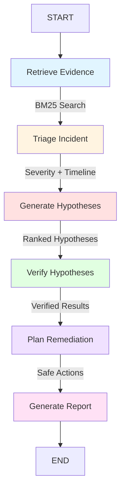

# OpsPilot Agent

**Evidence-Grounded AI Agent for Software Incident Diagnosis**

OpsPilot is an intelligent agent system that assists DevOps and SRE teams in diagnosing software incidents by analyzing application logs, operational runbooks, and incident descriptions to provide evidence-based root cause hypotheses and safe remediation recommendations.

---

## The Problem

When production incidents occur, Site Reliability Engineers and DevOps teams must:
- Quickly assess incident severity
- Sift through thousands of log entries to find relevant evidence
- Correlate symptoms across multiple services
- Identify plausible root causes
- Determine safe remediation steps

This process is time-consuming, error-prone, and requires extensive domain knowledge. OpsPilot automates evidence collection and analysis while maintaining human oversight for all critical decisions.

---

## Key Features

### Core Functionality

**1. Log and Runbook Evidence Retrieval**
- BM25-based local search (no external dependencies)
- Parses structured log files preserving line numbers
- Indexes operational runbooks for diagnostic guidance
- Retrieves top-k most relevant evidence chunks

**2. Incident Triage**
- Automated severity classification (SEV1-SEV4)
- Service and symptom extraction from evidence
- Chronological timeline construction
- Evidence-grounded assessment (no invented data)

**3. Ranked Root Cause Hypotheses**
- Multiple plausible hypotheses generated
- Confidence scoring (0.0-1.0 scale)
- Supporting evidence citations
- Explicit distinction between correlation and causation

**4. Independent Evidence Verification**
- Deterministic verification of all hypotheses
- Fabrication detection (rejects unsupported claims)
- Evidence ID validation
- Confidence adjustment (never increases)

**5. Human-Reviewed Remediation Planning**
- Safe action recommendations (investigation, containment, recovery, prevention)
- Risk level assessment (low, medium, high, critical)
- Validation steps and rollback considerations
- **No automatic execution** - all actions require human approval

**6. Downloadable Incident Report**
- Professional Markdown format
- Evidence references with file:line citations
- Verified hypotheses and rejected claims
- Complete analysis limitations

---

## Operating Modes

### Offline Demo Mode (Default)
- **No API key required**
- Deterministic pattern-based analysis
- Fully reproducible results
- No network requests or costs
- Ideal for testing, development, and education

### Live LLM Mode (Optional)
- **Requires OpenAI-compatible API key**
- LLM-powered triage and hypothesis generation
- More flexible analysis of novel incidents
- Works with OpenAI or OpenRouter
- All LLM outputs independently verified
- Human review still required

**Both modes use:**
- Identical deterministic evidence retrieval
- Same independent verification process
- Same remediation planning logic
- Same reporting format

---

## Architecture

### LangGraph Workflow



### Safety Boundary

```
┌─────────────────────────────────────────┐
│  Automated Analysis (No Approval)       │
│  ├─ Evidence Retrieval                  │
│  ├─ Triage Assessment                   │
│  ├─ Hypothesis Generation               │
│  ├─ Independent Verification            │
│  └─ Report Generation                   │
└─────────────────────────────────────────┘
                   ↓
         ⚠️  HUMAN REVIEW REQUIRED
                   ↓
┌─────────────────────────────────────────┐
│  Actions Requiring Approval              │
│  ├─ Validate Root Cause                 │
│  ├─ Execute Remediation Steps           │
│  ├─ Restart Services                    │
│  ├─ Modify Configuration                │
│  └─ Change Production Systems           │
└─────────────────────────────────────────┘
```

### Repository Structure

```
opspilot-agent/
├── src/opspilot/
│   ├── agents/              # Agent implementations
│   │   ├── triage.py        # Demo triage (offline)
│   │   ├── diagnosis.py     # Demo diagnosis (offline)
│   │   ├── verifier.py      # Evidence verification
│   │   ├── remediation.py   # Safe remediation planning
│   │   ├── live_triage.py   # LLM triage (live mode)
│   │   └── live_diagnosis.py # LLM diagnosis (live mode)
│   ├── tools/               # Utilities
│   │   ├── log_parser.py    # Structured log parsing
│   │   └── evidence_retriever.py # BM25 evidence search
│   ├── config.py            # Configuration management
│   ├── models.py            # Pydantic data models
│   ├── llm_client.py        # LLM client abstraction
│   ├── workflow.py          # LangGraph workflow
│   ├── reporting.py         # Markdown report generation
│   └── ui.py                # Streamlit UI helpers
├── data/
│   ├── incidents/           # Sample incident data
│   │   ├── incident_001.json
│   │   └── incident_001_logs.txt
│   └── runbooks/            # Operational runbooks
│       └── database_connection_pool.md
├── tests/                   # Test suite (172 tests)
├── app.py                   # Streamlit application
├── requirements.txt         # Python dependencies
├── .env.example             # Configuration template
├── LICENSE                  # MIT License
└── README.md                # This file
```

---

## Installation

### Prerequisites

- **Python 3.11 or newer**
- pip package manager
- (Optional) OpenAI API key for live mode

### Setup Instructions

#### Windows

```powershell
# Clone or extract the repository
cd opspilot-agent

# Create virtual environment
python -m venv .venv
.venv\Scripts\activate

# Install dependencies
pip install -r requirements.txt

# Copy environment template
copy .env.example .env

# Edit .env if using live mode (optional)
notepad .env
```

#### macOS / Linux

```bash
# Clone or extract the repository
cd opspilot-agent

# Create virtual environment
python3 -m venv .venv
source .venv/bin/activate

# Install dependencies
pip install -r requirements.txt

# Copy environment template
cp .env.example .env

# Edit .env if using live mode (optional)
nano .env
```

---

## Running OpsPilot

### Streamlit Application

**Demo Mode (No API Key Required):**

```bash
streamlit run app.py
```

The application will open at `http://localhost:8501`

**Live Mode (Requires API Key):**

```bash
# Set environment variables
export OPSPILOT_MODE=live
export OPENAI_API_KEY=sk-your-actual-key

# Or configure in .env file, then:
streamlit run app.py
```

**OpenRouter Support:**

```bash
export OPSPILOT_MODE=live
export OPENAI_API_KEY=sk-or-your-openrouter-key
export OPENAI_BASE_URL=https://openrouter.ai/api/v1
export OPENAI_MODEL=openai/gpt-4o-mini
streamlit run app.py
```

### Running Tests

```bash
# Run complete test suite (172 tests)
pytest tests/

# Run with verbose output
pytest tests/ -v

# Run specific test file
pytest tests/test_workflow.py -v
```

---

## Configuration

### Environment Variables

Create a `.env` file from the template:

```bash
cp .env.example .env
```

**Available Settings:**

| Variable | Default | Description |
|----------|---------|-------------|
| `OPSPILOT_MODE` | `demo` | Operating mode: `demo` or `live` |
| `OPENAI_API_KEY` | None | API key (required for live mode) |
| `OPENAI_BASE_URL` | None | Custom API endpoint (for OpenRouter) |
| `OPENAI_MODEL` | `gpt-4o-mini` | Model identifier |
| `LLM_TIMEOUT_SECONDS` | `60` | API call timeout (10-300) |
| `LLM_MAX_RETRIES` | `2` | Maximum retry attempts (0-3) |

### ⚠️ Security Warning

**NEVER commit your `.env` file or API credentials to version control!**

- The `.env` file contains your API key and is excluded by `.gitignore`
- Only `.env.example` (with placeholders) should be committed
- API usage in live mode incurs provider costs
- Keep your API key confidential

---

## Sample Incident

OpsPilot includes a synthetic incident for demonstration:

**Incident ID:** INC-2024-001  
**Title:** Order Service API Unavailable - High Latency and 503 Errors  
**Scenario:** Database connection pool exhaustion

**Timeline:**
1. Reporting worker starts long-running query (14:15:03)
2. Connection pool gradually exhausts (14:20:16)
3. Order service experiences timeouts
4. API gateway returns HTTP 503 errors
5. Query completes and services recover (14:26:05)

**Included Data:**
- `incident_001.json` - Incident metadata
- `incident_001_logs.txt` - 34 timestamped log entries
- `database_connection_pool.md` - Operational runbook

**Expected Results:**
- Severity: SEV2 (High)
- Verified Hypothesis: Connection pool exhaustion (confidence: 0.90-0.95)
- Remediation: Increase pool size, implement monitoring

This realistic scenario demonstrates evidence-grounded analysis without using real production data.

---

## Safety and Limitations

### Safety Guarantees

✅ **Evidence-Grounded:** All conclusions cite specific evidence  
✅ **Human Review Required:** No automatic execution of remediation  
✅ **Independent Verification:** LLM outputs verified by deterministic logic  
✅ **Confidence Capped:** Never claims certainty (max 0.95)  
✅ **Fabrication Detection:** Rejects hypotheses without supporting evidence  
✅ **Safe Error Handling:** Never exposes API keys or credentials  

### Current Limitations

**Scope:**
- Single incident analysis (no trend detection)
- Text-based logs only (no metrics or traces)
- English language only
- Structured log format required

**Analysis:**
- Correlation vs. causation explicitly noted
- Limited to patterns recognizable in logs
- Cannot verify hypotheses without additional tools
- No real-time monitoring integration

**Scale:**
- Evidence limited to top-k chunks
- Single organization's runbooks only
- No distributed tracing support

### Future Improvements

- Multi-incident correlation
- Metrics and traces integration
- Real-time monitoring hooks
- Distributed tracing support
- Multi-language support
- Custom log format adapters
- Integration with incident management tools (PagerDuty, Jira)

---

## Open-Source Reference

**Project:** HolmesGPT  
**GitHub:** https://github.com/HolmesGPT/holmesgpt  
**Description:** HolmesGPT is a comprehensive AI-assisted SRE investigation platform by Robusta that provides intelligent runbook execution, alert investigation, and incident analysis capabilities for Kubernetes environments.

**Relationship to OpsPilot:**

OpsPilot is a smaller, **independent educational implementation** focused specifically on evidence-grounded incident diagnosis. While HolmesGPT inspired the problem space, OpsPilot was designed and implemented independently with different architecture choices:

- **HolmesGPT:** Production-ready platform with Kubernetes integration, Prometheus metrics, and comprehensive tool ecosystem
- **OpsPilot:** Educational project focusing on evidence-based reasoning, verification, and human-review boundaries

**No HolmesGPT source code was copied or derived.** OpsPilot was built from scratch as a learning exercise in LLM application development, multi-agent systems, and safe AI deployment.

---

## AI-Assisted Development

This project was developed with assistance from AI coding tools:

**Tools Used:**

- **ChatGPT/Claude** - Project planning, architecture design, debugging assistance, testing strategy, and documentation guidance
- **GitHub Copilot Agent** - Code generation, refactoring suggestions, test generation, and implementation assistance

**Development Process:**

1. **AI-Generated Content:** AI tools provided code suggestions, architectural patterns, test cases, and documentation drafts
2. **Human Review:** All generated code was reviewed, tested, and validated by the project author
3. **Execution and Testing:** Code was executed locally, tested with 172 automated tests, and manually verified in the Streamlit application
4. **Version Control:** All changes tracked in git with human-authored commit messages
5. **Validation:** AI suggestions were not accepted as proof of correctness - automated tests and manual application testing were used to verify functionality

**Learning Outcomes:**

This project demonstrates the effective use of AI pair programming tools while maintaining:
- Code quality through comprehensive testing
- Security through manual review of generated code
- Understanding through hands-on implementation and debugging
- Ownership through independent architectural decisions

---

## Testing

OpsPilot includes **172 automated tests** covering:

- Configuration management and validation
- Evidence retrieval and log parsing
- Triage assessment logic
- Hypothesis generation and ranking
- Independent verification
- Remediation planning
- Report generation
- LLM client abstraction
- Live mode integration
- UI components
- Workflow orchestration
- Security (credential protection)

**Test Coverage:**
- Unit tests for individual components
- Integration tests for workflow
- Fake LLM client for offline testing
- No network requests in test suite

Run tests with:
```bash
pytest tests/ -v
```

---

## License

MIT License - See [LICENSE](LICENSE) file for details.

Copyright (c) 2026 Ali Tariq

---

## Acknowledgments

- **HolmesGPT** for inspiration in the SRE AI agent space
- **LangChain/LangGraph** for workflow orchestration patterns
- **Streamlit** for rapid UI development
- **Pydantic** for data validation
- **OpenAI** for LLM API compatibility standards

---

## Support and Contributing

This is an educational portfolio project developed for academic purposes. While it's not actively seeking contributions, feedback and suggestions are welcome through GitHub issues.

**For Questions:**
- Review the documentation above
- Check the test suite for usage examples
- Examine the sample incident for expected behavior

---

**Built with** ❤️ **for the SRE community**
