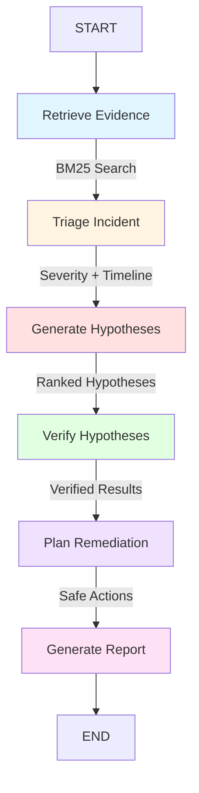

# OpsPilot Agent

**Evidence-Grounded AI Agent for Software Incident Diagnosis**

OpsPilot is an intelligent agent system that assists DevOps and SRE teams in diagnosing software incidents by analyzing application logs, operational runbooks, and incident descriptions to provide evidence-based root cause hypotheses and safe remediation recommendations.

---

## The Problem

When production incidents occur, Site Reliability Engineers and DevOps teams must:
- Quickly assess incident severity
- Sift through thousands of log entries to find relevant evidence
- Correlate symptoms across multiple services
- Identify plausible root causes
- Determine safe remediation steps

This process is time-consuming, error-prone, and requires extensive domain knowledge. OpsPilot automates evidence collection and analysis while maintaining human oversight for all critical decisions.

---

## Key Features

### Core Functionality

**1. Log and Runbook Evidence Retrieval**
- BM25-based local search (no external dependencies)
- Parses structured log files preserving line numbers
- **Docker container log support** (JSON format)
- **Kubernetes pod log support** (timestamped format)
- **User file upload support** (logs and runbooks, 10 MB limit)
- Extracts and indexes container/pod metadata
- Indexes operational runbooks for diagnostic guidance
- Retrieves top-k most relevant evidence chunks
- In-memory processing (uploaded files never saved to disk)

**2. Incident Triage**
- Automated severity classification (SEV1-SEV4)
- Service and symptom extraction from evidence
- Chronological timeline construction
- Evidence-grounded assessment (no invented data)

**3. Ranked Root Cause Hypotheses**
- Multiple plausible hypotheses generated
- Confidence scoring (0.0-1.0 scale)
- Supporting evidence citations
- Explicit distinction between correlation and causation

**4. Independent Evidence Verification**
- Deterministic verification of all hypotheses
- Fabrication detection (rejects unsupported claims)
- Evidence ID validation
- Confidence adjustment (never increases)

**5. Human-Reviewed Remediation Planning**
- Safe action recommendations (investigation, containment, recovery, prevention)
- Risk level assessment (low, medium, high, critical)
- Validation steps and rollback considerations
- **No automatic execution** - all actions require human approval

**6. Downloadable Incident Report**
- Professional Markdown format
- Evidence references with file:line citations
- Verified hypotheses and rejected claims
- Complete analysis limitations

---

## Operating Modes

### Offline Demo Mode (Default)
- **No API key required**
- Deterministic pattern-based analysis
- Fully reproducible results
- No network requests or costs
- Ideal for testing, development, and education

### Live LLM Mode (Optional)
- **Requires OpenAI-compatible API key**
- LLM-powered triage and hypothesis generation
- More flexible analysis of novel incidents
- Works with OpenAI or OpenRouter
- All LLM outputs independently verified
- Human review still required

**Both modes use:**
- Identical deterministic evidence retrieval
- Same independent verification process
- Same remediation planning logic
- Same reporting format

---

## Architecture

### LangGraph Workflow


```mermaid
graph TD
    A[START] --> B[Retrieve Evidence]
    B -->|BM25 Search| C[Triage Incident]
    C -->|Severity + Timeline| D[Generate Hypotheses]
    D -->|Ranked Hypotheses| E[Verify Hypotheses]
    E -->|Verified Results| F[Plan Remediation]
    F -->|Safe Actions| G[Generate Report]
    G --> H[END]
    
    style B fill:#e1f5ff
    style C fill:#fff4e1
    style D fill:#ffe1e1
    style E fill:#e1ffe1
    style F fill:#f0e1ff
    style G fill:#ffe1f5
```

### Safety Boundary

```
┌─────────────────────────────────────────┐
│  Automated Analysis (No Approval)       │
│  ├─ Evidence Retrieval                  │
│  ├─ Triage Assessment                   │
│  ├─ Hypothesis Generation               │
│  ├─ Independent Verification            │
│  └─ Report Generation                   │
└─────────────────────────────────────────┘
                   ↓
         ⚠️  HUMAN REVIEW REQUIRED
                   ↓
┌─────────────────────────────────────────┐
│  Actions Requiring Approval              │
│  ├─ Validate Root Cause                 │
│  ├─ Execute Remediation Steps           │
│  ├─ Restart Services                    │
│  ├─ Modify Configuration                │
│  └─ Change Production Systems           │
└─────────────────────────────────────────┘
```

### Repository Structure

```
opspilot-agent/
├── src/opspilot/
│   ├── agents/              # Agent implementations
│   │   ├── triage.py        # Demo triage (offline)
│   │   ├── diagnosis.py     # Demo diagnosis (offline)
│   │   ├── verifier.py      # Evidence verification
│   │   ├── remediation.py   # Safe remediation planning
│   │   ├── live_triage.py   # LLM triage (live mode)
│   │   └── live_diagnosis.py # LLM diagnosis (live mode)
│   ├── tools/               # Utilities
│   │   ├── log_parser.py    # Structured log parsing
│   │   ├── container_log_parser.py # Docker/Kubernetes log parsing
│   │   └── evidence_retriever.py # BM25 evidence search
│   ├── evaluation/          # Benchmark framework
│   │   ├── models.py        # Benchmark data models
│   │   ├── metrics.py       # Metric calculation
│   │   ├── executor.py      # Benchmark execution
│   │   ├── reporter.py      # Report generation
│   │   ├── runner.py        # CLI runner
│   │   └── __main__.py      # Module entry point
│   ├── config.py            # Configuration management
│   ├── models.py            # Pydantic data models
│   ├── llm_client.py        # LLM client abstraction
│   ├── workflow.py          # LangGraph workflow
│   ├── reporting.py         # Markdown report generation
│   ├── ui.py                # Streamlit UI helpers
│   ├── upload_validator.py  # File upload validation
│   └── upload_handler.py    # Upload processing
├── data/
│   ├── incidents/           # Sample incident data
│   │   ├── incident_001.json
│   │   ├── incident_001_logs.txt (plain text)
│   │   ├── incident_002.json + incident_002_http_503.txt
│   │   ├── incident_003.json + incident_003_crashloop.docker.log
│   │   ├── incident_004.json + incident_004_insufficient.txt
│   │   ├── order-service-a3f8d2.docker.log (Docker)
│   │   ├── api-gateway-7b9c4e.docker.log (Docker)
│   │   ├── postgres-pod_default_postgres.k8s.log (Kubernetes)
│   │   └── reporting-worker-pod_jobs_worker.k8s.log (Kubernetes)
│   ├── runbooks/            # Operational runbooks
│   │   └── database_connection_pool.md
│   └── evaluation/          # Benchmark cases
│       └── benchmark_cases.json
├── tests/                   # Test suite (205 tests)
├── app.py                   # Streamlit application
├── requirements.txt         # Python dependencies
├── .env.example             # Configuration template
├── LICENSE                  # MIT License
└── README.md                # This file
```

---

## Installation

### Prerequisites

- **Python 3.11 or newer**
- pip package manager
- (Optional) OpenAI API key for live mode

### Setup Instructions

#### Windows

```powershell
# Clone or extract the repository
cd opspilot-agent

# Create virtual environment
python -m venv .venv
.venv\Scripts\activate

# Install dependencies
pip install -r requirements.txt

# Copy environment template
copy .env.example .env

# Edit .env if using live mode (optional)
notepad .env
```

#### macOS / Linux

```bash
# Clone or extract the repository
cd opspilot-agent

# Create virtual environment
python3 -m venv .venv
source .venv/bin/activate

# Install dependencies
pip install -r requirements.txt

# Install OpsPilot package (required for CLI tools)
pip install -e .

# Copy environment template
cp .env.example .env

# Edit .env if using live mode (optional)
nano .env
```

---

## Running OpsPilot

### Streamlit Application

**Demo Mode (No API Key Required):**

```bash
streamlit run app.py
```

The application will open at `http://localhost:8501`

**Live Mode (Requires API Key):**

```bash
# Set environment variables
export OPSPILOT_MODE=live
export OPENAI_API_KEY=sk-your-actual-key

# Or configure in .env file, then:
streamlit run app.py
```

**OpenRouter Support:**

```bash
export OPSPILOT_MODE=live
export OPENAI_API_KEY=sk-or-your-openrouter-key
export OPENAI_BASE_URL=https://openrouter.ai/api/v1
export OPENAI_MODEL=openai/gpt-4o-mini
streamlit run app.py
```

### Using the Application

OpsPilot supports two evidence modes:

1. **Sample Incident (Demo)** - Use the included sample incident with pre-loaded logs and runbooks
2. **Upload Your Own Files** - Upload custom logs and runbooks for investigation

#### Upload Custom Evidence

**Accepted Log Formats:**
- **Extensions:** `.log`, `.txt`
- **Formats:** Plain text, Docker JSON, Kubernetes timestamped
- **Maximum size:** 10 MB per file
- **Multiple files:** Upload as many as needed

**Accepted Runbook Formats:**
- **Extensions:** `.md`, `.txt`
- **Content:** Markdown or plain text documentation
- **Maximum size:** 10 MB per file
- **Multiple files:** Upload as many as needed

**Upload Process:**
1. Select "Upload Your Own Files" as evidence source
2. Fill in incident details (ID, title, description)
3. Upload log files using the "Choose log files" uploader
4. Upload runbooks using the "Choose runbook files" uploader
5. Verify upload status shows loaded entries
6. Configure investigation query and run investigation

**Security Guarantees:**
- ✅ All processing happens in-memory (files never saved to disk)
- ✅ Uploaded content treated as untrusted evidence text
- ✅ No execution of log content, commands, or scripts
- ✅ Safe error messages (no internal paths or stack traces)
- ✅ File size limits prevent resource exhaustion
- ✅ Only allowed extensions accepted
- ✅ Binary and malformed files rejected safely

### Running Tests

```bash
# Run complete test suite (311 tests)
pytest tests/

# Run with verbose output
pytest tests/ -v

# Run specific test file
pytest tests/test_workflow.py -v
```

---

## Configuration

### Environment Variables

Create a `.env` file from the template:

```bash
cp .env.example .env
```

**Available Settings:**

| Variable | Default | Description |
|----------|---------|-------------|
| `OPSPILOT_MODE` | `demo` | Operating mode: `demo` or `live` |
| `OPENAI_API_KEY` | None | API key (required for live mode) |
| `OPENAI_BASE_URL` | None | Custom API endpoint (for OpenRouter) |
| `OPENAI_MODEL` | `gpt-4o-mini` | Model identifier |
| `LLM_TIMEOUT_SECONDS` | `60` | API call timeout (10-300) |
| `LLM_MAX_RETRIES` | `2` | Maximum retry attempts (0-3) |

### ⚠️ Security Warning

**NEVER commit your `.env` file or API credentials to version control!**

- The `.env` file contains your API key and is excluded by `.gitignore`
- Only `.env.example` (with placeholders) should be committed
- API usage in live mode incurs provider costs
- Keep your API key confidential

---

## Container Log Support

### Docker Container Logs

OpsPilot supports exported Docker container logs in JSON format:

```json
{"log":"2024-03-15T14:20:16Z ERROR [order-service] Connection timeout\n","stream":"stderr","time":"2024-03-15T14:20:16.123456789Z"}
```

**Supported Export Methods:**
```bash
# Export single container logs
docker logs <container-id> --timestamps > container.docker.log

# Export with container info in filename
docker logs order-service > order-service-abc123.docker.log
```

**Extracted Metadata:**
- Container ID (from filename or metadata)
- Container name (from filename or metadata)
- Stream type (stdout/stderr)
- Timestamps (Docker timestamp and log message timestamp)
- Structured log fields (level, service, message)

### Kubernetes Pod Logs

OpsPilot supports exported Kubernetes pod logs in standard format:

```
2024-03-15T14:20:16.123456789Z stdout F 2024-03-15T14:20:16Z ERROR [service] Message
```

**Supported Export Methods:**
```bash
# Export single container logs
kubectl logs <pod-name> -c <container-name> --timestamps > pod.k8s.log

# Export with full metadata in filename
kubectl logs order-pod -c app --timestamps > order-pod_production_app.k8s.log

# Export multiple containers
kubectl logs postgres-pod -c postgres > postgres-pod_default_postgres.k8s.log
```

**Extracted Metadata:**
- Pod name (from filename or kubectl context)
- Namespace (from filename or kubectl context)
- Container name (from filename or kubectl context)
- Stream type (stdout/stderr)
- Timestamps (Kubernetes timestamp and log message timestamp)
- Structured log fields (level, service, message)

### File Naming Conventions

**Docker logs:**
- `<container-name>-<container-id>.docker.log` - Recommended
- `<container-name>.docker.json` - Alternative
- Auto-detection for `.log` or `.json` files with JSON content

**Kubernetes logs:**
- `<pod-name>_<namespace>_<container-name>.k8s.log` - Recommended
- `<pod-name>_<container-name>.kubernetes.log` - Alternative
- Auto-detection for logs with Kubernetes format pattern

### Evidence Citations with Container Metadata

Container logs preserve full metadata in evidence citations:

**Docker Evidence:**
```
Evidence ev_a3f8d2c1b5e4 (order-service-abc123.docker.log:6)
Container: order-service (ID: abc123)
2024-03-15T14:20:16Z ERROR [order-service] Connection pool exhausted
```

**Kubernetes Evidence:**
```
Evidence ev_7b9c4e8d2a1f (postgres-pod_default_postgres.k8s.log:4)
Pod: postgres-pod, Namespace: default, Container: postgres
2024-03-15T14:22:01Z DEBUG [postgres] Connection pool: 20/20 active
```

### Mixed Environment Support

OpsPilot can analyze incidents spanning multiple environments:
- Plain text application logs
- Docker container logs from development/staging
- Kubernetes pod logs from production clusters
- All logs indexed together for cross-environment correlation

### Limitations

**Processing Only:**
- OpsPilot processes **exported log files** only
- Does **not** connect to Docker daemons or Kubernetes clusters
- Does **not** require credentials or cluster access
- Does **not** stream logs in real-time

**Multiline Logs:**
- Kubernetes partial lines (P flag) are currently skipped
- For stack traces spanning multiple lines, export with full lines (F flag)
- Consider pre-processing multiline logs before export

**Format Requirements:**
- Docker logs must be valid JSON with `log`, `stream`, and `time` fields
- Kubernetes logs must follow standard `kubectl logs --timestamps` format
- Structured log messages inside container logs are parsed when possible

---

## Sample Incident

OpsPilot includes a synthetic incident for demonstration:

**Incident ID:** INC-2024-001  
**Title:** Order Service API Unavailable - High Latency and 503 Errors  
**Scenario:** Database connection pool exhaustion

**Timeline:**
1. Reporting worker starts long-running query (14:15:03)
2. Connection pool gradually exhausts (14:20:16)
3. Order service experiences timeouts
4. API gateway returns HTTP 503 errors
5. Query completes and services recover (14:26:05)

**Included Data:**
- `incident_001.json` - Incident metadata
- `incident_001_logs.txt` - 34 timestamped plain text log entries
- `order-service-a3f8d2.docker.log` - Docker container logs (12 entries)
- `api-gateway-7b9c4e.docker.log` - Docker container logs (8 entries)
- `postgres-pod_default_postgres.k8s.log` - Kubernetes pod logs (7 entries)
- `reporting-worker-pod_jobs_worker.k8s.log` - Kubernetes pod logs (3 entries)
- `database_connection_pool.md` - Operational runbook

**Expected Results:**
- Severity: SEV2 (High)
- Verified Hypothesis: Connection pool exhaustion (confidence: 0.90-0.95)
- Remediation: Increase pool size, implement monitoring

This realistic scenario demonstrates evidence-grounded analysis without using real production data.

---

## Evaluation Benchmark

OpsPilot includes an offline evaluation framework to measure and demonstrate system quality.

### Purpose

The benchmark provides:
- **Reproducible evaluation** - Deterministic offline mode requires no API key
- **Quality metrics** - Quantitative assessment of diagnosis accuracy
- **Regression detection** - Detect quality degradation during development
- **Demonstrable results** - Clear metrics for portfolio/interview presentation

### Running the Benchmark

**Prerequisites:**
```bash
# Install the OpsPilot package first (if not already done)
pip install -e .
```

**Run the benchmark:**
```bash
# Run evaluation benchmark (offline, no API key required)
python -m opspilot.evaluation.runner
```

**Output locations:**
- **Console:** Concise summary with aggregate metrics
- **JSON:** `evaluation_results/benchmark_demo.json` (machine-readable)
- **Markdown:** `evaluation_results/benchmark_demo.md` (human-readable)

### Benchmark Scenarios

The evaluation includes 4 labeled synthetic incidents:

1. **case_001_connection_pool** - Database connection pool exhaustion
   - Expected: SEV2, services detected, connection/pool concepts
   
2. **case_002_http_503** - Repeated HTTP 503 service unavailable errors
   - Expected: SEV2, API gateway + order service, 503/gateway concepts
   
3. **case_003_container_crashloop** - Container restart and crash loop (OOMKilled)
   - Expected: SEV2, payment service, crash/memory/restart concepts
   
4. **case_004_insufficient_evidence** - Minimal evidence, no clear diagnosis
   - Expected: SEV4, no services, most claims rejected

### Metrics

**Severity Accuracy:**
- Ratio of cases where predicted severity matches expected
- Range: 0.0 to 1.0 (higher is better)

**Service Identification:**
- **Precision:** TP / (TP + FP) - Accuracy of predicted services
- **Recall:** TP / (TP + FN) - Coverage of expected services
- **F1:** Harmonic mean of precision and recall
- Range: 0.0 to 1.0 (higher is better)

**Diagnosis Quality:**
- **Precision:** Relevant concepts / Predicted concepts
- **Recall:** Relevant concepts / Expected concepts
- Extracted from verified hypothesis text (title, description)
- Range: 0.0 to 1.0 (higher is better)

**Citation Validity:**
- Ratio of cited evidence IDs that exist in available evidence
- Validates that all citations reference real evidence
- Range: 0.0 to 1.0 (1.0 = all citations valid)

**Rejected Claim Rate:**
- Ratio of expected-rejected concepts found in rejected hypotheses
- Measures ability to reject unsupported claims
- Range: 0.0 to 1.0 (higher is better)

**Execution Success:**
- Whether workflow completed without errors
- Binary: success or failure per case

### Live Mode Comparison (Optional)

If a valid API key is configured:
```bash
# Configure live mode in .env
OPSPILOT_MODE=live
OPENAI_API_KEY=sk-your-key

# Run benchmark (includes both demo and live)
python -m src.opspilot.evaluation.runner
```

Output includes both `benchmark_demo.json/md` and `benchmark_live.json/md` for comparison.

**Note:** Live mode is optional. The default benchmark runs entirely offline.

### Limitations

- **Synthetic scenarios:** Not real production incidents
- **Small dataset:** 4 cases (not statistically significant)
- **Keyword matching:** Diagnosis precision uses simple keyword extraction
- **No ground truth:** Expected values are approximate, not absolute
- **Deterministic only:** Demo mode uses pattern-based agents, not LLMs

### Example Results

Typical demo mode results:
```
Total Cases: 4
Successful: 4/4

Aggregate Metrics:
  Severity Accuracy:     75%
  Service F1:            35%
  Diagnosis Recall:      39%
  Citation Validity:     100%
```

Results demonstrate system capabilities for technical interviews and portfolio reviews.

---

## Safety and Limitations

### Safety Guarantees

✅ **Evidence-Grounded:** All conclusions cite specific evidence  
✅ **Human Review Required:** No automatic execution of remediation  
✅ **Independent Verification:** LLM outputs verified by deterministic logic  
✅ **Confidence Capped:** Never claims certainty (max 0.95)  
✅ **Fabrication Detection:** Rejects hypotheses without supporting evidence  
✅ **Safe Error Handling:** Never exposes API keys or credentials  

### Current Limitations

**Scope:**
- Single incident analysis (no trend detection)
- Text-based logs only (no metrics or traces)
- Exported logs only (no live cluster connections)
- English language only
- Structured log format preferred (unstructured messages indexed as-is)

**Analysis:**
- Correlation vs. causation explicitly noted
- Limited to patterns recognizable in logs
- Cannot verify hypotheses without additional tools
- No real-time monitoring integration

**Scale:**
- Evidence limited to top-k chunks
- Single organization's runbooks only
- No distributed tracing support

### Future Improvements

- Multi-incident correlation
- Metrics and traces integration
- Real-time monitoring hooks
- Distributed tracing support
- Multi-language support
- Custom log format adapters
- Integration with incident management tools (PagerDuty, Jira)

---

## Open-Source Reference

**Project:** HolmesGPT  
**GitHub:** https://github.com/HolmesGPT/holmesgpt  
**Description:** HolmesGPT is a comprehensive AI-assisted SRE investigation platform by Robusta that provides intelligent runbook execution, alert investigation, and incident analysis capabilities for Kubernetes environments.

**Relationship to OpsPilot:**

OpsPilot is a smaller, **independent educational implementation** focused specifically on evidence-grounded incident diagnosis. While HolmesGPT inspired the problem space, OpsPilot was designed and implemented independently with different architecture choices:

- **HolmesGPT:** Production-ready platform with Kubernetes integration, Prometheus metrics, and comprehensive tool ecosystem
- **OpsPilot:** Educational project focusing on evidence-based reasoning, verification, and human-review boundaries

**No HolmesGPT source code was copied or derived.** OpsPilot was built from scratch as a learning exercise in LLM application development, multi-agent systems, and safe AI deployment.

---

## AI-Assisted Development

This project was developed with assistance from AI coding tools:

**Tools Used:**

- **ChatGPT/Claude** - Project planning, architecture design, debugging assistance, testing strategy, and documentation guidance
- **GitHub Copilot Agent** - Code generation, refactoring suggestions, test generation, and implementation assistance

**Feature Development:**

This project demonstrates incremental feature development with AI assistance:
- **Initial implementation** (Phases 1-5): Core incident investigation workflow with offline demo mode and optional live LLM mode
- **Container log ingestion** (GitHub Issue #2): Docker and Kubernetes log parsing, metadata extraction, and integration with existing evidence retrieval system
- **User file uploads** (GitHub Issue #1): File validation, in-memory processing, upload UI, and integration with investigation workflow
- **Evaluation benchmark** (GitHub Issue #5): Offline evaluation framework with labeled scenarios, quality metrics, deterministic execution, and JSON/Markdown reporting

**Development Process:**

1. **AI-Generated Content:** AI tools provided code suggestions, architectural patterns, test cases, and documentation drafts
2. **Human Review:** All generated code was reviewed, tested, and validated by the project author
3. **Execution and Testing:** Code was executed locally, tested with 172 automated tests, and manually verified in the Streamlit application
4. **Version Control:** All changes tracked in git with human-authored commit messages
5. **Validation:** AI suggestions were not accepted as proof of correctness - automated tests and manual application testing were used to verify functionality

**Learning Outcomes:**

This project demonstrates the effective use of AI pair programming tools while maintaining:
- Code quality through comprehensive testing
- Security through manual review of generated code
- Understanding through hands-on implementation and debugging
- Ownership through independent architectural decisions

---

## Testing

OpsPilot includes **311 automated tests** covering:

- Configuration management and validation
- Evidence retrieval and log parsing
- **Docker container log parsing** (25 tests)
- **Kubernetes pod log parsing** (integrated in container tests)
- **Container evidence retrieval** (8 integration tests)
- **File upload validation** (36 tests)
- **Upload handler and processing** (23 tests)
- **Evaluation metrics** (26 tests)
- **Benchmark execution** (15 tests)
- **CLI integration** (6 tests)
- Triage assessment logic
- Hypothesis generation and ranking
- Independent verification
- Remediation planning
- Report generation
- LLM client abstraction
- Live mode integration
- UI components
- Workflow orchestration
- Security (credential protection, untrusted content handling)

**Test Coverage:**
- Unit tests for individual components
- Integration tests for workflow
- Fake LLM client for offline testing
- No network requests in test suite

Run tests with:
```bash
pytest tests/ -v
```

---

## License

MIT License - See [LICENSE](LICENSE) file for details.

Copyright (c) 2026 Ali Tariq

---

## Acknowledgments

- **HolmesGPT** for inspiration in the SRE AI agent space
- **LangChain/LangGraph** for workflow orchestration patterns
- **Streamlit** for rapid UI development
- **Pydantic** for data validation
- **OpenAI** for LLM API compatibility standards

---

## Support and Contributing

This is an educational portfolio project developed for academic purposes. While it's not actively seeking contributions, feedback and suggestions are welcome through GitHub issues.

**For Questions:**
- Review the documentation above
- Check the test suite for usage examples
- Examine the sample incident for expected behavior

---

**Built with** ❤️ **for the SRE community**
